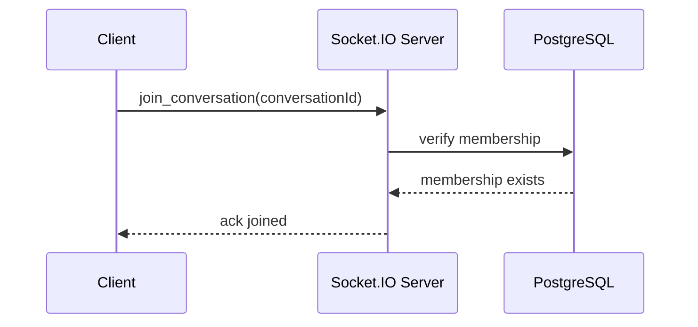
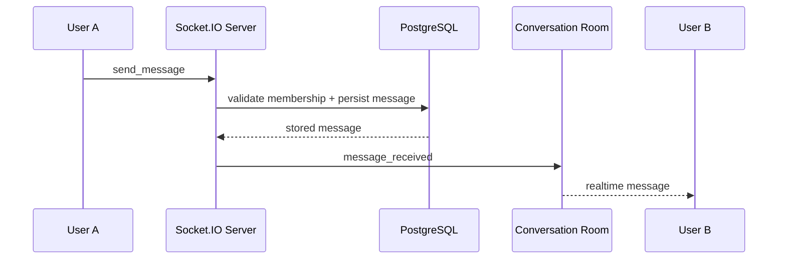

# Backend Overview

Phase 1 is a REST-only Node.js and Express backend with PostgreSQL and JWT authentication.

Phase 2 adds a single-server Socket.IO layer for real-time messaging without introducing Redis yet.

## Folder Structure

- `src/config` - environment parsing and database connectivity
- `src/controllers` - HTTP request handlers
- `src/services` - business logic
- `src/repositories` - SQL access layer
- `src/middleware` - auth, validation, and error handling
- `src/routes` - route composition
- `src/sockets` - Socket.IO server, auth, room management, and message handlers
- `src/models` - placeholder for domain notes; phase 1 uses SQL tables and repository mappers instead of an ORM
- `src/utils` - shared helpers

## Database Design

- `users` stores identity and profile fields.
- `conversations` stores direct chat threads.
- `conversation_members` links users to conversations and is the access boundary for membership checks.
- `messages` stores message history and references both the conversation and the sender.

Phase 2 adds `client_message_id` to `messages` so the write path can deduplicate retries from reconnects or repeated acknowledgements.

The schema files live at `sql/001_initial_schema.sql` and `sql/002_phase2_socket_idempotency.sql`.

## Security Notes

- Passwords are hashed with bcrypt before storage.
- JWTs are required for protected endpoints.
- Parameterized SQL is used throughout the repository layer.
- Message writes are protected by a database trigger that rejects senders who are not members of the conversation.

## Socket.IO Architecture

### Why rooms are needed

Each direct conversation maps to a Socket.IO room named `conversation:<conversationId>`. Rooms let the server fan out one event to all active sockets in a conversation without manually tracking socket ids.

### Room lifecycle

1. The client connects with a JWT.
2. The socket joins a private user room immediately.
3. The client calls `join_conversation` for each active thread.
4. The server validates membership and joins the conversation room.
5. `send_message` persists to PostgreSQL and broadcasts `message_received` to the room.
6. `leave_conversation` removes the socket from the room.
7. `disconnect` clears all joined conversation rooms for that socket.

### Message flow

1. User A sends `send_message` with `conversationId`, `body`, and `clientMessageId`.
2. The Socket.IO server validates the JWT identity and the event payload.
3. The message service verifies conversation membership.
4. PostgreSQL inserts the message or returns the existing row if the same `clientMessageId` was already processed.
5. The server updates the conversation's `last_message_id`.
6. The server broadcasts `message_received` to `conversation:<conversationId>`.
7. User B receives the message instantly if connected to that room.

### Single-server scalability limits

This architecture works on one Node.js instance because every connected socket and every room exist in the same memory space. The limitation appears once multiple Node.js instances are introduced: a room join on instance A is invisible to instance B, so broadcasts and presence events stop reaching every participant consistently.

Redis Pub/Sub becomes necessary in Phase 3 because it provides a shared cross-process event bus. Each Node.js instance can publish room events to Redis and subscribe to them, which keeps Socket.IO room fan-out correct across a horizontally scaled cluster.

## Example Frontend Flow

```text
connect -> authenticate with JWT -> join_conversation -> send_message -> message_received
```

Use the JWT from login as the Socket.IO `auth.token` value, then rejoin any open conversations after reconnect.

## Sequence Diagrams

### Join conversation



### Send message


