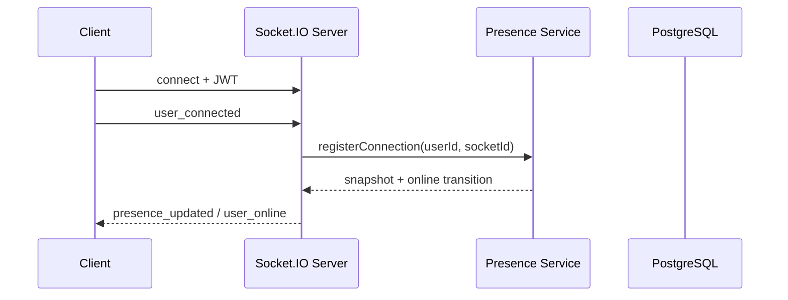
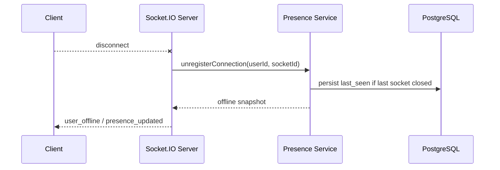
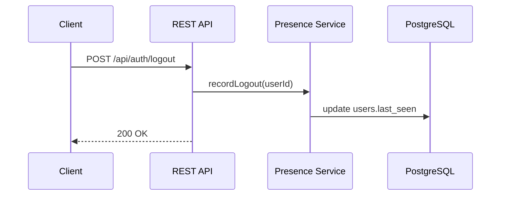
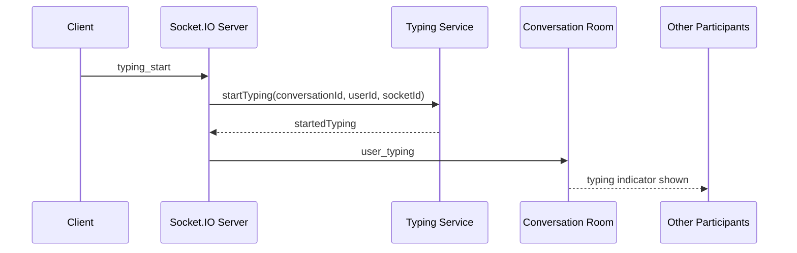
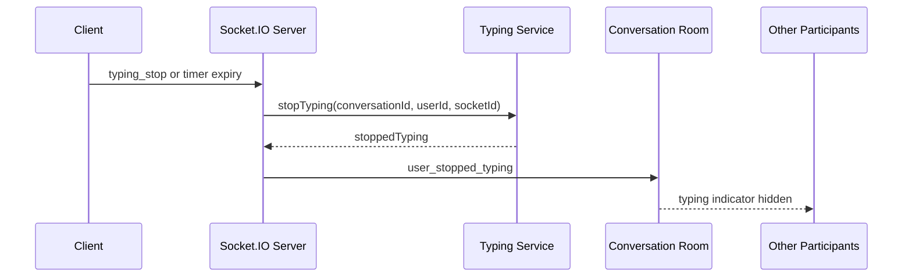
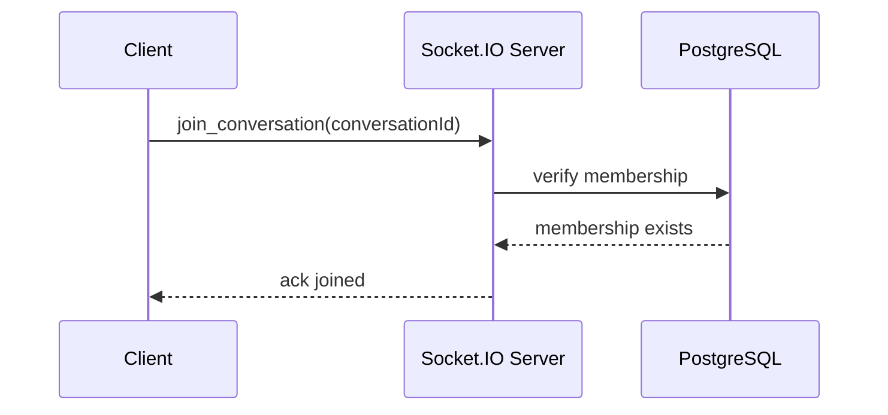
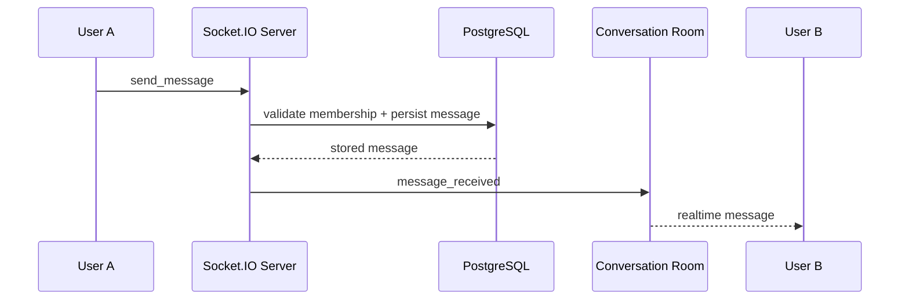
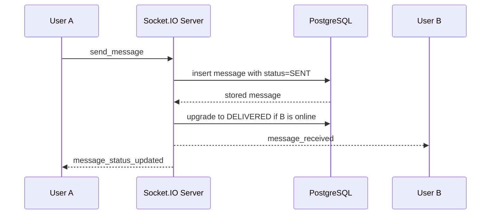
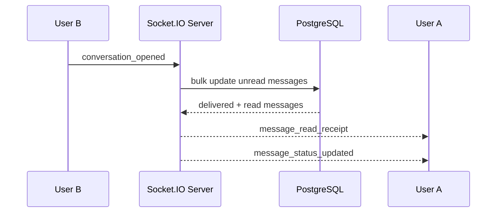

# Backend Overview

Phase 1 is a REST-only Node.js and Express backend with PostgreSQL and JWT authentication.

Phase 2 adds a single-server Socket.IO layer for real-time messaging without introducing Redis yet.

Phase 3 adds in-memory presence tracking and a `GET /api/users/:id/presence` API.

Phase 4 adds typing indicators using Socket.IO and in-memory state only.

Phase 5 adds message life cycle sent-> delivered-> read

## Folder Structure

- `src/config` - environment parsing and database connectivity
- `src/controllers` - HTTP request handlers
- `src/repositories` - SQL access layer
- `src/middleware` - auth, validation, and error handling
- `src/routes` - route composition
- `src/sockets` - Socket.IO server, auth, room management, message handlers, presence, and typing handlers
- `src/services` - business logic, including presence, typing, delivery, and read-receipt services
- `src/models` - placeholder for domain notes; phase 1 uses SQL tables and repository mappers instead of an ORM
- `src/utils` - shared helpers

## Database Design

- `users` stores identity and profile fields.
- `conversations` stores direct chat threads.
- `conversation_members` links users to conversations and is the access boundary for membership checks.
- `messages` stores message history and references both the conversation and the sender.

`users.last_seen` stores the most recent offline/logout timestamp for each user.

Phase 2 adds `client_message_id` to `messages` so the write path can deduplicate retries from reconnects or repeated acknowledgements.

The schema files live at `sql/001_initial_schema.sql` and `sql/002_phase2_socket_idempotency.sql`.

## Security Notes

- Passwords are hashed with bcrypt before storage.
- JWTs are required for protected endpoints.
- Parameterized SQL is used throughout the repository layer.
- Message writes are protected by a database trigger that rejects senders who are not members of the conversation.

## Presence Architecture

Presence is intentionally split into two layers:

- In-memory store for online users and active socket ids.
- PostgreSQL `users.last_seen` for the durable last-seen timestamp.

The service abstraction keeps these concerns isolated so Redis can replace the in-memory store later without changing socket handlers or controllers.

### Why in-memory works now

The current deployment target is a single Node.js instance, so the full presence map can live in process memory. This gives low latency, no extra infrastructure, and straightforward active-connection counting for multiple tabs or devices.

### Limitations

In-memory presence is lost on process restart, cannot be shared across multiple Node.js servers, and grows with the number of currently online users. It also cannot survive a crash, which means the database `last_seen` remains the durable fallback.

### Connection lifecycle

1. User logs in and receives a JWT.
2. The client opens a Socket.IO connection with that JWT.
3. The client emits `user_connected`.
4. The presence service records the socket id for that user and marks them online when the first connection arrives.
5. The client emits periodic `heartbeat` events while connected.
6. If one socket disconnects but other tabs or devices remain open, the user stays online.
7. When the final socket disconnects, the service records `users.last_seen`, removes the user from memory, and broadcasts `user_offline`.
8. A logout request also updates `users.last_seen` without forcing the user offline if other sockets are still active.

### API response

`GET /api/users/:id/presence` returns:

```json
{
	"userId": "123",
	"isOnline": true,
	"activeConnectionsCount": 2,
	"lastSeen": "2026-06-01T10:00:00Z"
}
```

### Scalability discussion

Presence is harder than message delivery because it is stateful and per-user. One server can count sockets in memory, but multiple Node.js instances will diverge unless they share state. Redis will be required later because it can store per-user connection sets and publish join/leave transitions across all instances through Pub/Sub.

Redis Pub/Sub solves cross-server tracking by letting every instance publish `user_online` and `user_offline` changes and subscribe to the same stream. Each server can then update its own local view and keep client notifications consistent.

## Sequence Diagrams

### Socket connection and registration



### Disconnect



### Logout



## Socket.IO Architecture

### Why rooms are needed

Each direct conversation maps to a Socket.IO room named `conversation:<conversationId>`. Rooms let the server fan out one event to all active sockets in a conversation without manually tracking socket ids.

### Room lifecycle

1. The client connects with a JWT.
2. The socket joins a private user room immediately.
3. The client calls `join_conversation` for each active thread.
4. The server validates membership and joins the conversation room.
5. `send_message` persists to PostgreSQL and broadcasts `message_received` to the room.
6. `leave_conversation` removes the socket from the room.
7. `disconnect` clears all joined conversation rooms for that socket.

### Message flow

1. User A sends `send_message` with `conversationId`, `body`, and `clientMessageId`.
2. The Socket.IO server validates the JWT identity and the event payload.
3. The message service verifies conversation membership.
4. PostgreSQL inserts the message or returns the existing row if the same `clientMessageId` was already processed.
5. The server updates the conversation's `last_message_id`.
6. The server broadcasts `message_received` to `conversation:<conversationId>`.
7. User B receives the message instantly if connected to that room.

### Single-server scalability limits

This architecture works on one Node.js instance because every connected socket and every room exist in the same memory space. The limitation appears once multiple Node.js instances are introduced: a room join on instance A is invisible to instance B, so broadcasts and presence events stop reaching every participant consistently.

Redis Pub/Sub becomes necessary in Phase 3 because it provides a shared cross-process event bus. Each Node.js instance can publish room events to Redis and subscribe to them, which keeps Socket.IO room fan-out correct across a horizontally scaled cluster.

## Typing Indicators

Typing indicators are ephemeral events and should not be stored in PostgreSQL. Messages and read receipts are durable application state, but typing is only meaningful while a user is actively editing input. Persisting it would create write amplification, stale rows, and cleanup problems without giving clients any durable value.

### Why rooms are used

Typing notifications are broadcast through the existing `conversation:<conversationId>` room so only the participants in that conversation receive the event. That avoids polling and avoids sending typing updates to unrelated users.

### Event lifecycle

1. The frontend detects input and emits `typing_start` for the conversation.
2. The server validates membership and room participation.
3. The typing service records the user as active in the conversation.
4. The server broadcasts `user_typing` to the conversation room.
5. A 3-second inactivity timer is armed per socket.
6. If no more input arrives, the timer expires and the server emits `user_stopped_typing`.
7. If the user explicitly stops typing or disconnects, the same cleanup path runs immediately.

### Typing service design

The typing service uses in-memory maps keyed by `conversationId`, then `userId`, then `socketId`. That lets the server support multiple tabs and devices without duplicating typing notifications. A user is considered typing if at least one of their sockets is active in that conversation.

The cleanup strategy is simple:

- clear the per-socket inactivity timer when typing stops
- remove the socket id from the active set
- remove the user entry when the last socket stops
- remove the conversation entry when no users remain

That keeps memory bounded to currently active typing sessions and avoids leaks.

### Best practices

- Debounce typing events on the client so keypresses do not spam the server.
- Treat the server timer as a safety net, not the primary source of truth.
- Ignore repeated `typing_start` events from the same socket while already active.
- Clear timers on `typing_stop` and `disconnect`.
- Keep the service interface narrow so Redis can replace the store later without changing socket handlers.

### Scalability discussion

Typing traffic is high-frequency and short-lived, so it becomes noisy at scale. Multiple Node.js instances will each see only their local sockets, which means typing state will fragment unless a shared backplane is introduced later. Redis Pub/Sub is the natural next step because it can propagate `typing_start` and `typing_stop` across all servers without changing the public typing service interface.

### Example frontend flow

```text
input event -> typing_start -> server broadcasts user_typing -> idle timeout -> user_stopped_typing
```

### Sequence diagrams

#### Start typing



#### Stop typing



## Example Frontend Flow

```text
connect -> authenticate with JWT -> join_conversation -> send_message -> message_received
```

Use the JWT from login as the Socket.IO `auth.token` value, then rejoin any open conversations after reconnect.

## Sequence Diagrams

### Join conversation



### Send message



## Message Delivery Status

Message delivery status uses a simple state machine:

- `SENT` - the message is stored in PostgreSQL.
- `DELIVERED` - the recipient socket received the message.
- `READ` - the recipient opened the conversation and the message was read.

### Lifecycle

1. User A sends a message.
2. The server persists the message with `status = SENT`.
3. If User B is online, the server upgrades the message to `DELIVERED` and emits it immediately.
4. When User B opens the conversation, unread messages are upgraded in bulk to `READ`.
5. The server emits status updates back to User A so the UI can render delivery and read check marks.

### Database changes

Phase 5 adds `status`, `delivered_at`, and `read_at` to `messages` in [sql/004_phase5_message_status.sql](sql/004_phase5_message_status.sql).

Indexing strategy:

- `conversation_id, status, created_at` supports inbox, delivery, and receipt queries.
- `sender_id, status, created_at` supports sender-side status updates.
- A partial unread index keeps bulk read receipts narrow and avoids scanning already-read rows.

### Socket events

Client to server:

- `message_delivered`
- `message_read`
- `conversation_opened`

Server to client:

- `message_status_updated`
- `message_read_receipt`

Responsibilities:

- `message_delivered` confirms that a recipient device received a message.
- `message_read` confirms that a specific message was viewed.
- `conversation_opened` performs bulk read receipts when a thread becomes active.
- `message_status_updated` informs the sender about state transitions.
- `message_read_receipt` carries the compact read-receipt payload for the UI.

### Service design

- `messageService.js` persists messages and fetches history.
- `deliveryService.js` handles `SENT -> DELIVERED` transitions.
- `readReceiptService.js` handles `DELIVERED -> READ` transitions and bulk conversation receipts.

The transition rules are centralized in [src/utils/messageStatus.js](src/utils/messageStatus.js) so invalid downgrades such as `READ -> DELIVERED` are rejected consistently.

### Delivery logic

If the recipient is online, the server upgrades the message to `DELIVERED` right away and emits it to the recipient's user room.

If the recipient is offline, the message stays `SENT` until the user reconnects and opens the conversation. That keeps the state accurate without writing fake delivery events.

### Read receipt logic

When a user opens a conversation, the server identifies unread messages from the other participant, updates them in bulk, and notifies the sender.

Bulk updates are necessary because they reduce round-trips, reduce socket spam, and let the server reconcile a backlog of unread messages in one transaction.

### Performance considerations

- Use bulk updates instead of one database write per message.
- Keep delivery and read operations idempotent so duplicate socket events are harmless.
- Emit one aggregated receipt on `conversation_opened` instead of a stream of per-message notifications.
- Index by `conversation_id`, `status`, and `created_at` to keep the hot queries narrow.
- Use the existing user room to notify only the sockets that need the update.

### Edge cases

- Multiple devices are supported because all sockets for a user share the user room.
- Multiple tabs are supported because repeated delivery and read events are no-ops.
- Reconnection is handled by re-processing pending `SENT` messages on conversation open.
- Duplicate events are ignored by the state machine.
- Delayed delivery is resolved when the recipient comes back online.

### Scalability discussion

Read receipts are more expensive than messages because they create extra writes and notifications on top of the base message traffic.

This single-server design works because all sockets share one process and one PostgreSQL writer. At scale, multiple Node.js servers will fragment receipts unless the state is shared. Redis Pub/Sub is the natural next step for cross-server socket fan-out, and Kafka would only be useful later if you want a durable downstream event stream.

### Example frontend flow

```text
send_message -> message_received -> message_delivered -> conversation_opened -> message_read
```

### Sequence diagrams

#### Sending message



#### Read receipt flow


