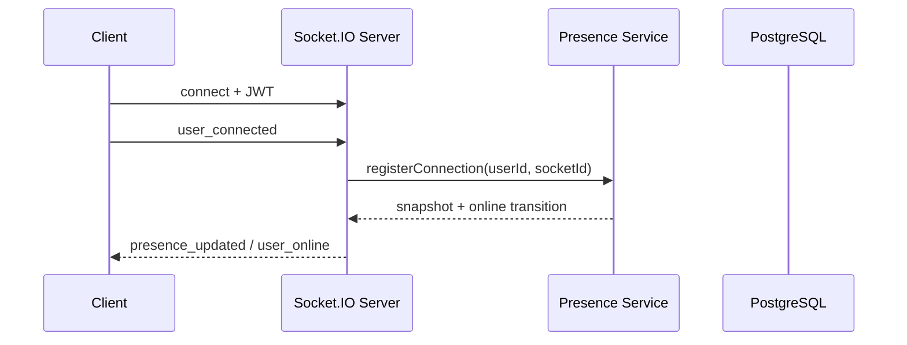
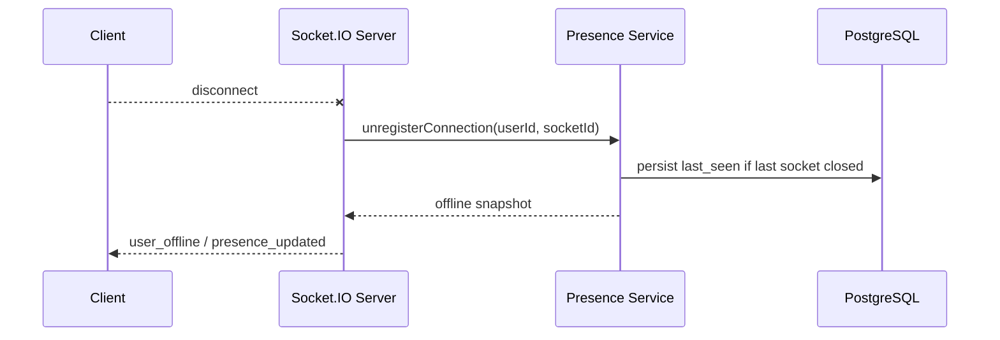
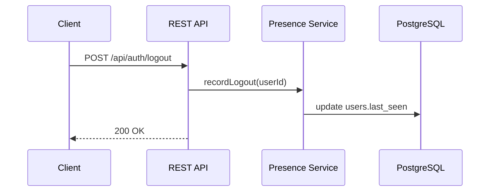
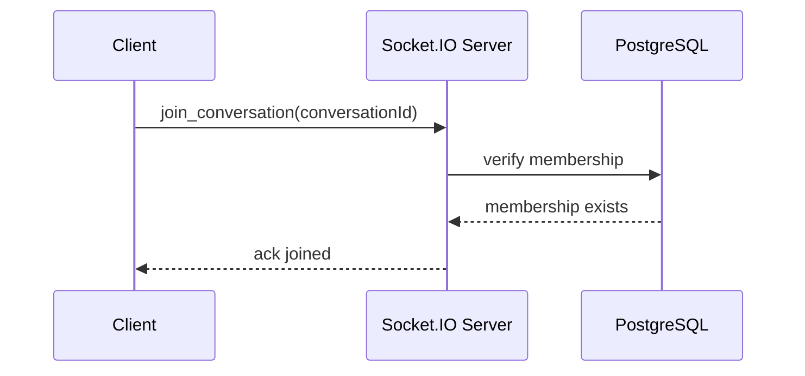
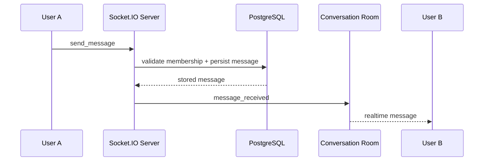

# Backend Overview

Phase 1 is a REST-only Node.js and Express backend with PostgreSQL and JWT authentication.

Phase 2 adds a single-server Socket.IO layer for real-time messaging without introducing Redis yet.

Phase 3 adds in-memory presence tracking and a `GET /api/users/:id/presence` API.

## Folder Structure

- `src/config` - environment parsing and database connectivity
- `src/controllers` - HTTP request handlers
- `src/repositories` - SQL access layer
- `src/middleware` - auth, validation, and error handling
- `src/routes` - route composition
- `src/sockets` - Socket.IO server, auth, room management, and message handlers
- `src/services` - business logic, including the presence service abstraction
- `src/models` - placeholder for domain notes; phase 1 uses SQL tables and repository mappers instead of an ORM
- `src/utils` - shared helpers

## Database Design

- `users` stores identity and profile fields.
- `conversations` stores direct chat threads.
- `conversation_members` links users to conversations and is the access boundary for membership checks.
- `messages` stores message history and references both the conversation and the sender.

`users.last_seen` stores the most recent offline/logout timestamp for each user.

Phase 2 adds `client_message_id` to `messages` so the write path can deduplicate retries from reconnects or repeated acknowledgements.

The schema files live at `sql/001_initial_schema.sql` and `sql/002_phase2_socket_idempotency.sql`.

## Security Notes

- Passwords are hashed with bcrypt before storage.
- JWTs are required for protected endpoints.
- Parameterized SQL is used throughout the repository layer.
- Message writes are protected by a database trigger that rejects senders who are not members of the conversation.

## Presence Architecture

Presence is intentionally split into two layers:

- In-memory store for online users and active socket ids.
- PostgreSQL `users.last_seen` for the durable last-seen timestamp.

The service abstraction keeps these concerns isolated so Redis can replace the in-memory store later without changing socket handlers or controllers.

### Why in-memory works now

The current deployment target is a single Node.js instance, so the full presence map can live in process memory. This gives low latency, no extra infrastructure, and straightforward active-connection counting for multiple tabs or devices.

### Limitations

In-memory presence is lost on process restart, cannot be shared across multiple Node.js servers, and grows with the number of currently online users. It also cannot survive a crash, which means the database `last_seen` remains the durable fallback.

### Connection lifecycle

1. User logs in and receives a JWT.
2. The client opens a Socket.IO connection with that JWT.
3. The client emits `user_connected`.
4. The presence service records the socket id for that user and marks them online when the first connection arrives.
5. The client emits periodic `heartbeat` events while connected.
6. If one socket disconnects but other tabs or devices remain open, the user stays online.
7. When the final socket disconnects, the service records `users.last_seen`, removes the user from memory, and broadcasts `user_offline`.
8. A logout request also updates `users.last_seen` without forcing the user offline if other sockets are still active.

### API response

`GET /api/users/:id/presence` returns:

```json
{
	"userId": "123",
	"isOnline": true,
	"activeConnectionsCount": 2,
	"lastSeen": "2026-06-01T10:00:00Z"
}
```

### Scalability discussion

Presence is harder than message delivery because it is stateful and per-user. One server can count sockets in memory, but multiple Node.js instances will diverge unless they share state. Redis will be required later because it can store per-user connection sets and publish join/leave transitions across all instances through Pub/Sub.

Redis Pub/Sub solves cross-server tracking by letting every instance publish `user_online` and `user_offline` changes and subscribe to the same stream. Each server can then update its own local view and keep client notifications consistent.

## Sequence Diagrams

### Socket connection and registration



### Disconnect



### Logout



## Socket.IO Architecture

### Why rooms are needed

Each direct conversation maps to a Socket.IO room named `conversation:<conversationId>`. Rooms let the server fan out one event to all active sockets in a conversation without manually tracking socket ids.

### Room lifecycle

1. The client connects with a JWT.
2. The socket joins a private user room immediately.
3. The client calls `join_conversation` for each active thread.
4. The server validates membership and joins the conversation room.
5. `send_message` persists to PostgreSQL and broadcasts `message_received` to the room.
6. `leave_conversation` removes the socket from the room.
7. `disconnect` clears all joined conversation rooms for that socket.

### Message flow

1. User A sends `send_message` with `conversationId`, `body`, and `clientMessageId`.
2. The Socket.IO server validates the JWT identity and the event payload.
3. The message service verifies conversation membership.
4. PostgreSQL inserts the message or returns the existing row if the same `clientMessageId` was already processed.
5. The server updates the conversation's `last_message_id`.
6. The server broadcasts `message_received` to `conversation:<conversationId>`.
7. User B receives the message instantly if connected to that room.

### Single-server scalability limits

This architecture works on one Node.js instance because every connected socket and every room exist in the same memory space. The limitation appears once multiple Node.js instances are introduced: a room join on instance A is invisible to instance B, so broadcasts and presence events stop reaching every participant consistently.

Redis Pub/Sub becomes necessary in Phase 3 because it provides a shared cross-process event bus. Each Node.js instance can publish room events to Redis and subscribe to them, which keeps Socket.IO room fan-out correct across a horizontally scaled cluster.

## Example Frontend Flow

```text
connect -> authenticate with JWT -> join_conversation -> send_message -> message_received
```

Use the JWT from login as the Socket.IO `auth.token` value, then rejoin any open conversations after reconnect.

## Sequence Diagrams

### Join conversation



### Send message


